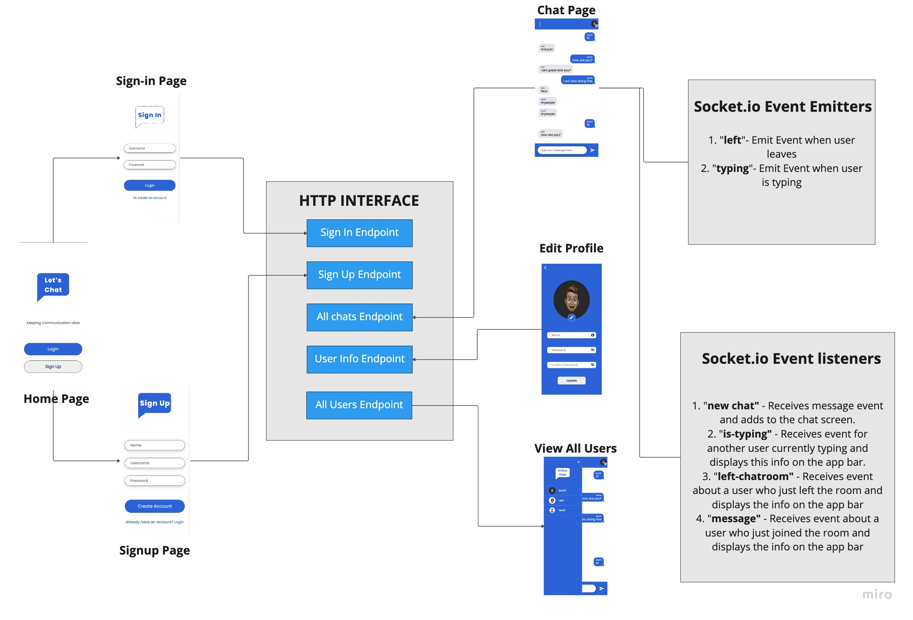
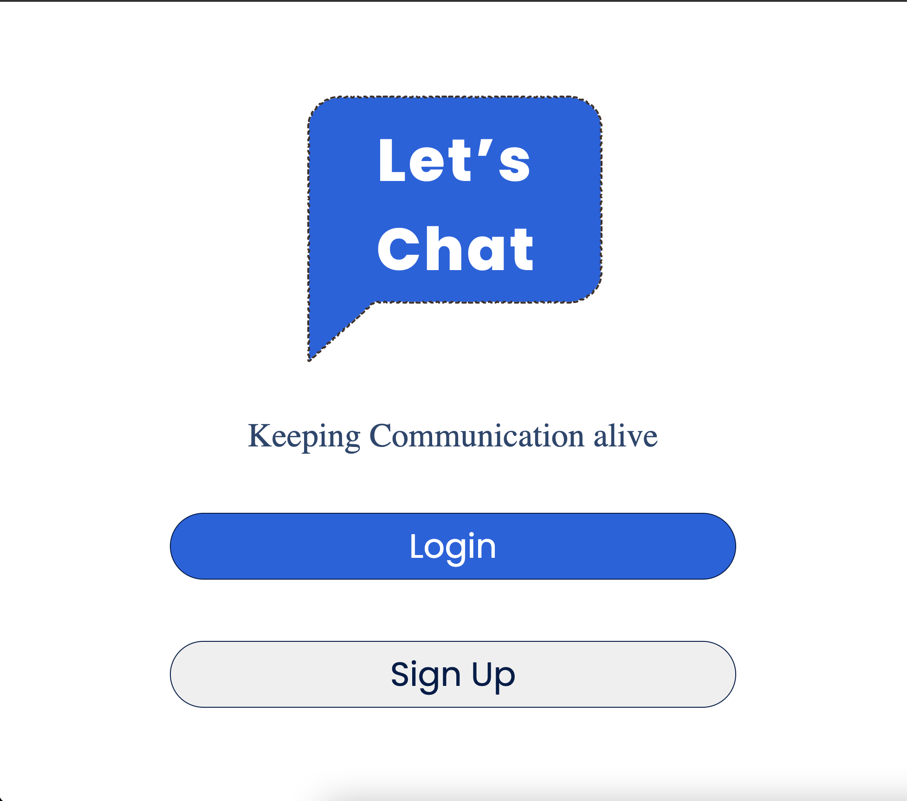
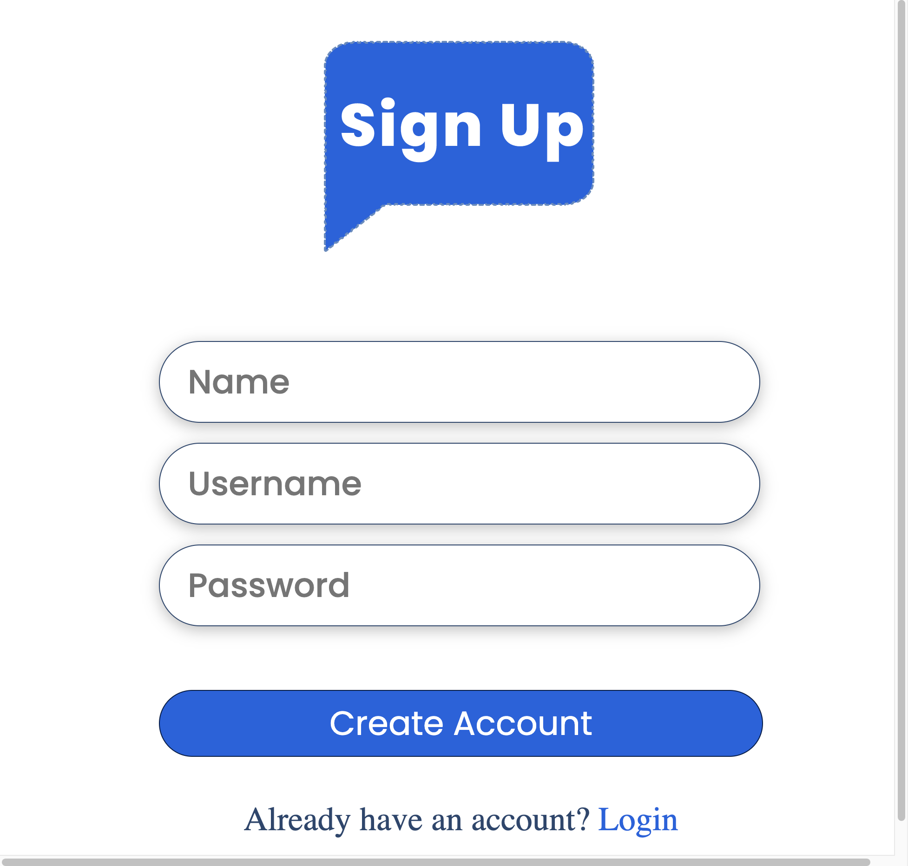
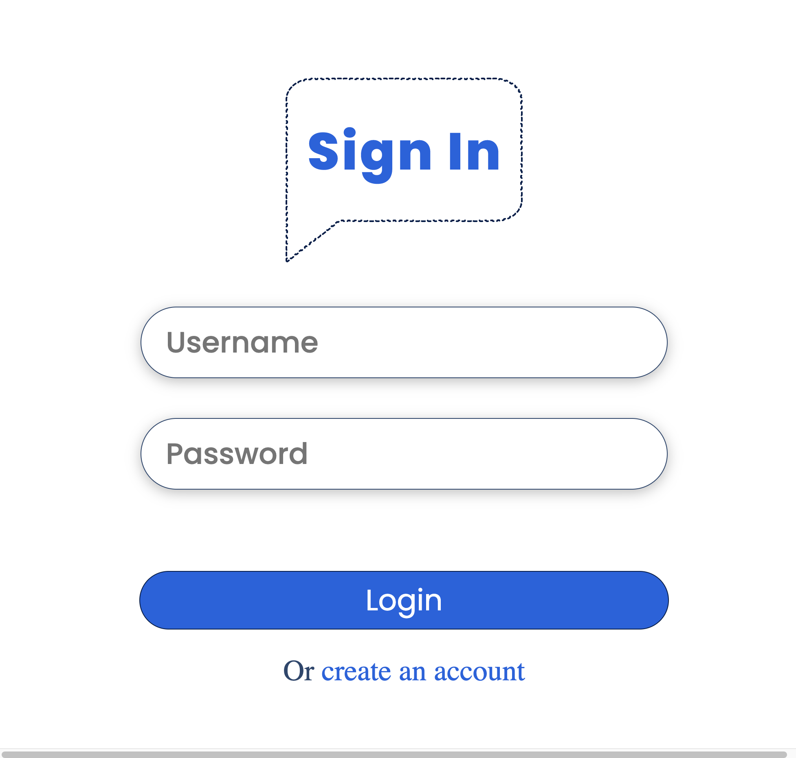
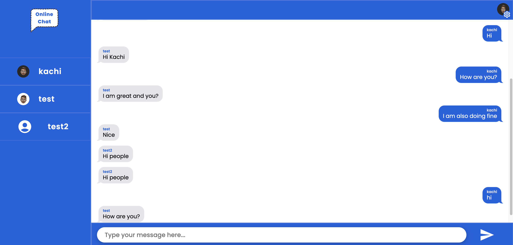

## Chat App

An chat application that uses socket.io events to display popups when a new user joins or leaves the room as well as when a user in the room is typing. It is built with React, Redux, JavaScript, and CSS.

# To Visit App:

[Chat App](https://quick-chat-app22.netlify.app/)

## Project Screen Shot(s)

### Frontend Architecture

### Homepage

### Sign Up Page

### Sign In Page

### Chat Page

## Installation and Setup Instructions

First clone and set up the backend server [[here](https://github.com/Kachielite/Chat-App-Backend). Then clone down this repository. You will need `node` and `npm` installed globally on your machine.

Installation:

`npm install`  

To Run Test Suite:  

`npm test`  

To Start Server:

`npm start`  

To Visit App:

`localhost:3000`  

## Reflection
This is a side project focused on solidifying my knowledge on the use of socket.io on both the client and server side. 
    
The most challenging part was setting up event listeners and event emitters on both ends. After successfully setting up these events I noticed that the events were not working as expected. This issue was caused by not closing the old socket instance when the component is re-rendered. The old instance will continue to listen and cause memory overflow and update state errors. 
    
Introducing the useEffect hook to close socket instances when the component is rendered resolved the issues.

The technologies implemented in this project are React, React-Router 6.0, Redux, socketIO, axios, and a significant amount of VanillaJS, JSX, and CSS. I chose to use the `create-react-app` boilerplate to minimize initial setup and invest more time in diving into weird technological rabbit holes. 
